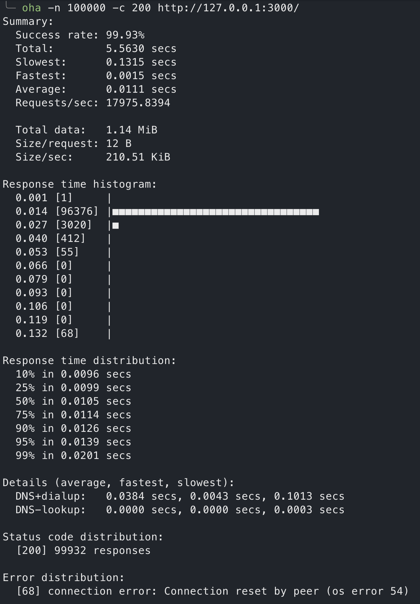
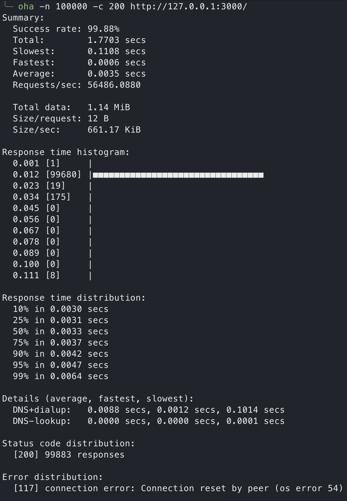
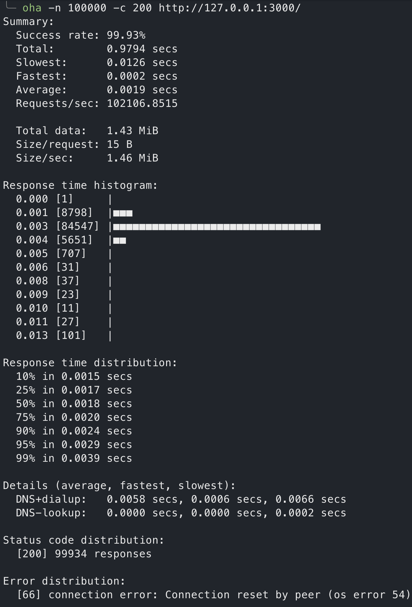

# Express.js & Node HTTP module & Bun Benchmark

## Script

```sh
oha -n 100000 -c 200 http://127.0.0.1:3000/
```

## Result

### Express.js: 17975 requests/sec



---

### Node HTTP module: 56486 requests/sec



---

### Bun: 102106 requests/sec


